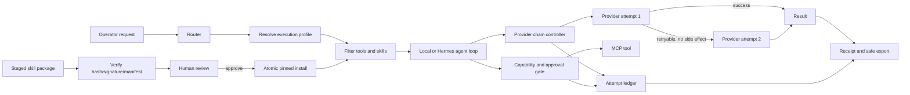

# PRD-TCLAW-RESILIENT-EXTENSIBILITY-001

Status: Final reviewed draft; human implementation approval required  
Version: 0.5  
Date: 2026-07-29  
Owner: TORQCLAW product/engineering  
Target: Windows-first local deployment; architecture must remain portable

## 1. Executive decision

Build a three-slice reliability and extensibility program:

1. Provider failover with side-effect-safe retry rules.
2. Named execution profiles that bind tools, paths, network reach, and approvals.
3. A verified skill package lifecycle with version pinning, hashes, signatures, staged review, and rollback.

Each slice ships independently. Provider failover is the first release because it improves existing tasks without asking users to install third-party content. Execution profiles ship before the registry because a skill must not be able to request permissions the runtime cannot express and enforce.

## 2. Problem

TORQCLAW currently has strong routing, approvals, receipts, MCP namespacing, capability classification, path scopes, local/cloud separation, and a Hermes-backed skill proposal queue. Three material gaps remain:

- A FRONTIER task has one selected provider/model configuration. A transient timeout, rate limit, outage, or exhausted account can terminate the task even when another configured provider is usable.
- Tool policy is distributed across task routing, MCP server configuration, capability classification, and approval logic. The operator cannot select or inspect one named execution posture such as `read_only` or `browser_research`.
- Learned skills can be reviewed through Hermes, but TORQCLAW has no first-class, versioned installation lifecycle for externally sourced skills. Copying community `SKILL.md` content directly into an agent creates prompt-injection, permission, provenance, and rollback risks.

The result is avoidable downtime, policy that is difficult to reason about, and no safe path to reuse the broader skills ecosystem.

## 3. Target users

Primary: the single-machine TORQCLAW operator who expects the assistant to complete local and cloud tasks reliably without silently widening access.

Secondary: contributors who add model providers, MCP servers, or skills and need deterministic validation and rollback behavior.

Not targeted in this PRD: untrusted public multi-user hosting, enterprise federation, mobile nodes, or a commercial skill marketplace.

## 4. Outcomes and measurable success

The program succeeds when:

- Every configured provider-chain test case produces a deterministic attempt order and terminal result.
- Retryable first-provider failures complete through a healthy fallback in integration tests.
- No provider failover replays a tool call or external side effect.
- Every task receipt records each provider attempt, reason for transition, elapsed time, and known cost provenance.
- Every task resolves to one named execution profile visible before dispatch and in its receipt.
- No tool outside the active profile is sent to the model or executable through the bridge.
- Every installed external skill has a pinned version, SHA-256 digest, source, permissions, installation decision, and recoverable previous version.
- Tampered, unsigned-when-required, path-traversing, malformed, or permission-escalating skill packages fail closed in automated tests.

## 5. Non-goals

- Browser-session or "zero-token" access to third-party model web applications.
- Automatic installation of skills from arbitrary chat links.
- Autonomous activation of a learned or downloaded skill without operator review.
- Executable install hooks, package-manager scripts, or arbitrary code inside a skill package.
- Cross-organization trust, billing, or marketplace payouts.
- Provider switching after an irreversible tool side effect in the same task.
- Replacing Hermes, the existing router, MCP bridge, or receipt system.
- Scheduling, multi-agent swarms, mobile clients, and voice interfaces in this program.

## 6. Assumptions

- TORQCLAW remains single-operator by default.
- Provider credentials remain in environment variables or an existing secret store; they are never copied into the provider-chain manifest, events, receipts, or safe exports.
- Hermes remains the FRONTIER agent loop and supports a fallback model configuration, but TORQCLAW owns policy, observability, and side-effect rules.
- Skills are declarative Markdown plus a manifest in v1. A skill cannot add executable code.
- Existing capability classification and approval gates remain authoritative. A skill can request a capability but cannot grant it.
- The local filesystem and MCP roster may be unavailable or partially degraded at startup; diagnostics must report this without inventing readiness.

## 7. Control and data flow



## 8. User flows

### 8.1 Provider fallback

1. Operator submits a normal task.
2. TORQCLAW resolves the task type, execution profile, budget, and ordered provider chain.
3. The console shows the selected first provider and the existence of fallbacks without exposing credentials.
4. If the attempt succeeds, TORQCLAW returns the result normally.
5. If it fails before any tool side effect with a retryable failure, TORQCLAW records the attempt and starts the next provider with the original immutable request.
6. If it fails after a tool side effect, TORQCLAW stops and explains that automatic replay was blocked to prevent duplicate action.
7. The receipt shows every attempt and the final provider.

### 8.2 Execution profile selection

1. The operator uses the default profile or selects a profile for the task/session.
2. Route preview shows the profile, tools included, path/network scope, and approval posture.
3. The gateway binds the profile into the immutable request.
4. The bridge sends only profile-allowed tool schemas to the model.
5. A call outside the profile fails closed even if a model fabricates or guesses a tool name.

### 8.3 Skill installation

1. Operator supplies a supported skill package URL/path or selects a staged package.
2. TORQCLAW downloads or copies it into a non-executable staging directory.
3. TORQCLAW parses the manifest, normalizes paths, computes a digest, verifies the signature policy, scans content, and compares requested permissions with available profiles.
4. The console shows source, author claim, digest, signature status, requested permissions, changed files, and warnings.
5. Operator approves or rejects.
6. Approval performs an atomic versioned install; rejection deletes or quarantines only the staged package.
7. Activation occurs only in profiles that satisfy the skill permission declaration.
8. Operator can disable, pin, upgrade, or roll back the skill.

## 9. Requirements by architecture layer

### 9.1 Core logic and agent behavior

#### Provider failover

- Define an ordered provider-chain configuration keyed by task class, with a default chain and optional coding chain.
- Provider entries reference credential environment-variable names; manifests must never contain credential values.
- Classify failures into:
  - Retryable: connection failure, DNS failure, timeout before side effect, HTTP 408, HTTP 429, and HTTP 5xx unless explicitly excluded.
  - Configuration/auth: invalid model, malformed request, HTTP 400, 401, 403, and 404. Fail closed by default; an operator may explicitly opt a chain into fallback for selected classes.
  - Budget: no fallback if a configured task budget cannot reserve the next attempt ceiling.
  - Side-effect uncertainty: once any tool dispatch is attempted, automatic provider transition is permanently blocked for that task in v1, regardless of the tool's claimed idempotency.
- V1 permits no same-provider retry and at most one provider transition. A later release may add replay only after an end-to-end durable execution ID, recipient-side deduplication, and `prepared`/`dispatched`/`completed`/`unknown` recovery protocol exist; `unknown` must never replay automatically.
- The attempt ledger records `no_dispatch` or `dispatch_attempted`. The bridge persists `dispatch_attempted` before forwarding a tool call. A crash, disconnect, or missing acknowledgement after that write is terminal for automatic failover.
- Every provider attempt has an immutable random attempt ID and monotonically increasing task attempt epoch. TORQCLAW durably records the active `(task ID, attempt ID, epoch)` before opening a provider request. The bridge accepts output, tool requests, and state changes only from that exact active tuple while the task is running.
- On controller/process recovery, an active pre-dispatch attempt becomes `orphaned`; TORQCLAW atomically closes its epoch before optionally creating the next eligible attempt at `epoch + 1`. Events from closed/orphaned epochs are rejected even though they share the task ID. A post-dispatch orphan remains terminal/uncertain under the no-replay rule.
- Each chain defines `attemptTimeoutMs` and `taskDeadlineMs`; defaults are 60,000 ms and 120,000 ms. Task start creates one absolute deadline covering queueing, provider calls, transition delay, and cancellation. Every operation is capped at `min(attemptTimeoutMs, remainingTaskTime)` and no transition may begin at or after the deadline.
- Timeout sends cancellation and waits at most 2,000 ms for acknowledgement. Missing acknowledgement makes the attempt terminal/uncertain and forbids transition; late output and tool requests are rejected by task ID. A timed-out attempt's cost reservation remains consumed at its full ceiling unless authoritative actual cost is later lower.
- Operator cancellation is an irreversible task transition. TORQCLAW durably records `cancel_requested` before signaling the provider/bridge, then forbids new attempts, transitions, and tool dispatches and rejects late events by task ID. Queue/jitter cancellation with no active operation completes as `cancelled`; an active operation gets 2,000 ms to acknowledge, after which the task is `cancelled_uncertain`. Any prior `dispatch_attempted` state remains visible and terminal. Reservations remain consumed at their full ceilings unless authoritative actual cost later reconciles lower; restart resumes cancellation and never fallback.
- The transition delay is randomized from 250-750 ms and counts against the absolute task deadline. A provider circuit opens for 60 seconds after three retryable pre-dispatch failures within five minutes.
- Transition checks use this fixed precedence: side-effect barrier, task deadline, privacy eligibility, budget reservation, circuit state, then retryable failure class.
- The original request, profile, granted tools, privacy mode, and budget constraints are immutable across attempts.
- A fallback cannot widen toolsets, paths, network policy, execution mode, or memory access.
- Do not concatenate partial prose from failed providers into the new attempt. Preserve diagnostic metadata separately.

#### Execution profiles

- Ship four built-in profiles:
  - `read_only`: read-class local tools only; no terminal, browser mutation, send, or writes.
  - `workspace_write`: filesystem reads/writes only inside configured workspace; writes require approval.
  - `browser_research`: browser navigation/snapshot/read operations; form submission, upload, and account-changing actions excluded by default.
  - `terminal_power`: terminal/process tools within configured backend restrictions; every exec and process mutation requires approval.
- Profiles are validated configuration, not prompt text.
- Profile resolution occurs before tool prediction and dispatch.
- Profile resolution produces a versioned effective-policy object containing the profile ID, tool-registry version, allowed operation IDs, capability classes, side-effect classes, path/network scopes, and approval requirements. Its SHA-256 hash is bound to the immutable task request.
- The bridge is the authoritative enforcement point. It re-resolves every direct or MCP tool operation through the versioned tool-policy registry and verifies the request's policy hash immediately before dispatch. Missing operations, aliases without registry entries, stale hashes, and hot-reload mismatches fail closed.
- Schema filtering is defense in depth and user guidance; it is not the security boundary.
- Unknown profiles, unknown capabilities, or malformed scopes fail closed.
- A task can request a stricter profile than the session default without approval. Widening requires operator confirmation.

#### Skills

- A v1 skill contains `SKILL.md` and `skill.json`; no other file type is required.
- `skill.json` requires: schema version, stable ID, version, display name, description, source, files with SHA-256 digests, required capabilities, compatible profiles, and optional Ed25519 signature metadata.
- Skill instructions are treated as untrusted data until installation and as lower authority than system policy after installation.
- Skills cannot override routing locks, budgets, capability classification, approval rules, path scopes, safe-export redaction, or provider-chain policy.
- Skill selection is conditional on task intent, active profile, and available tools. Do not inject every installed skill into every prompt.

Failure modes: retry storms, duplicated actions, provider loops, profile mismatch, oversized skill prompt injection, malicious manifests, stale signatures, and partial installs.

Tests: table-driven failure taxonomy, deterministic provider order, pre-dispatch persistence and crash barriers, profile monotonicity, policy-hash binding, direct/MCP/alias/nested-call denial, malicious package corpus, interrupted install recovery, and rollback.

Dependencies: Hermes fallback configuration, gateway request contracts, bridge registry, capability classifier, approvals, receipts, filesystem atomic rename, and Ed25519 verification from the Node standard crypto API.

### 9.2 Data and integrations

- Add validated configuration schemas for provider chains, profiles, trusted signing keys, and skill sources.
- Add a provider-attempt table or equivalent immutable event projection with task ID, attempt number, provider/model identifiers, start/end timestamps, normalized failure class, side-effect state, cost amount/source when known, and transition decision.
- Add installed-skill metadata with ID, version, digest, source, signature result, permissions, install timestamp, enabled state, and previous-version pointer.
- Never persist API keys, cookies, OAuth tokens, raw authorization headers, or unredacted provider error bodies.
- Safe exports include provider attempt summaries and skill provenance but exclude secrets and staged package contents by default.
- The skill downloader permits HTTPS and explicit local paths only. Remote download time is capped at 30 seconds and redirects at 3. Compressed bytes are capped at 1 MiB; uncompressed total at 2 MiB; expansion ratio at 10:1; `skill.json` at 64 KiB; `SKILL.md` at 512 KiB; and the package must contain exactly those two regular files with no nested archive, symlink, junction, or reparse point. Streaming download/extraction aborts immediately when a cap is crossed.
- A selected skill contributes at most 16,000 model tokens and all selected skills together at most 32,000 tokens. Prompt assembly rejects over-limit content rather than truncating signed bytes silently.

Failure modes: secret leakage, schema drift, duplicate IDs, source redirects, decompression bombs, symlink/path traversal, and database/manifest disagreement.

Tests: migration replay, redaction adversarial corpus, duplicate/version conflicts, size limits, redirect limits, path normalization, symlink rejection, and safe-export invariants.

### 9.3 State and memory

- Provider attempts are task-scoped and immutable after terminal completion.
- A fallback attempt receives the same assembled memory snapshot as the original attempt; it does not re-query memory and silently change context.
- Installed skill state is versioned. Activation state is separate from installation state.
- Skill content is never written into episodic memory merely because it was installed.
- Learned-skill drafts from Hermes use the same staging and approval lifecycle before activation.

Failure modes: memory divergence between attempts, skill rollback losing operator edits, and activation/install state drift.

Tests: frozen context hash across attempts, rollback restoration, restart recovery, and learned-skill convergence into the common lifecycle.

### 9.4 Interface surfaces

- Route preview displays selected profile and provider chain summary.
- Live task stream emits provider attempt start, normalized failure, transition, and selected fallback events.
- Approval cards distinguish tool execution approval from skill installation approval.
- Skill review shows a text diff and explicit permission delta.
- Add operator commands/API actions for:
  - listing provider chains and profiles;
  - listing, staging, approving, rejecting, enabling, disabling, pinning, upgrading, and rolling back skills;
  - running health checks that include provider/profile/skill configuration validity.
- Accessibility: every status and risk state has text, not color alone; keyboard operation covers review and approval actions.

Failure modes: credential disclosure, approval ambiguity, stale review data, and race between review and package mutation.

Tests: UI component tests, keyboard paths, stale digest rejection at approval time, single-operator authorization boundaries, and copy-safe diagnostics.

### 9.5 Governance and safety

- The registry has no "install and trust automatically" mode in v1.
- Local packages may be unsigned but require digest-bound operator review and approval. Every remote package must have an Ed25519 signature from an active operator-trusted key; if no trust root exists, remote installation is unavailable.
- Hash verification always applies, signed or unsigned.
- Trusted signing keys are operator-managed, identified by fingerprint, and scoped to allowed source origins. Source allowlists supplement cryptographic identity and never replace signature verification.
- Each remote trust entry names a separate revocation-authority public key and HTTPS revocation URL. Revocation documents are monotonically sequenced, signed canonical JSON containing `issuedAt`, `nextUpdate`, and revoked key fingerprints with effective times and reasons.
- Revocation state is refreshed before install, upgrade, enable, and at least every 24 hours while enabled. It is usable only until the earliest of the signed `nextUpdate`, 72 hours after verified fetch, or a stricter configured limit. Crossing any boundary blocks install, upgrade, enable, and task-time activation; offline operation does not extend validity.
- TORQCLAW persists the highest verified revocation sequence, highest signed `issuedAt`, last successful fetch wall time, and last observed wall time. It rejects sequence/`issuedAt` regression. Within one boot it computes cache age with a monotonic clock; across restarts it requires wall time not to regress by more than five minutes. A regression or inability to establish age marks time `untrusted` and disables remote-skill activation until an online signed document with both a strictly higher sequence and strictly later `issuedAt` is verified. Returning the same previously accepted document does not recover trust; if the authority has not published a newer document, remote skills remain disabled. Offline mode never overrides this fail-closed state.
- A revoked key disables and quarantines every affected installed version at startup, audit, or task resolution, whichever occurs first. Rollback may select only a version signed by an active key. Key rotation requires explicit operator approval; cross-signing is evidence but does not automatically grant trust.
- Install approval is bound to exact digest and permission set. Any changed byte or permission invalidates the approval.
- Skill upgrades cannot add permissions without a new explicit approval.
- Provider fallback obeys privacy and data-retention policy; providers not eligible for the task's data class are omitted before attempt one.
- Terminal and browser side effects retain existing one-time approval semantics.
- All new commands follow existing operator/channel/node authorization boundaries.

Failure modes: compromised signing key, confused-deputy installation, downgrade attack, permission laundering, provider data-policy mismatch, and replayed approval.

Tests: signature/canonicalization vectors, revoked/unknown/stale key rejection, offline and clock-rollback behavior, key rotation, already-enabled skill quarantine, downgrade policy, TOCTOU digest mutation, operator authorization, and privacy-chain filtering.

### 9.6 Observability and feedback loops

- Metrics: provider attempts by normalized outcome, fallback completion rate, duplicate-side-effect prevention count, profile selection, denied out-of-profile tools, skill verification failures, install/rollback counts, and prompt tokens attributable to skills.
- Receipts show observed facts only; unknown cost remains unknown.
- Add failure-injection fixtures for provider timeout, rate limit, malformed response, auth failure, and mid-tool disconnect.
- Add a local audit command that validates provider chains, profiles, installed skill digests, signatures, and permission compatibility without modifying state.
- No benchmark claim is published until reproduced in TORQCLAW's own benchmark harness.

Failure modes: high-cardinality telemetry, secret-bearing errors, misleading success metrics, and silent skipped verification.

Tests: metric cardinality bounds, redaction, receipt reconstruction, and audit command against tampered fixtures.

### 9.7 Delivery and operations

- Migrations are additive and reversible until the prior binary can no longer interpret state; crossing that boundary requires a documented backup.
- Feature flags independently gate provider chains, execution profiles, and skill installation.
- Existing single-provider behavior remains the default during initial rollout.
- Provide configuration examples that contain no usable credentials.
- `pnpm run doctor` reports malformed chains/profiles, missing referenced environment variables without revealing values, skill digest/signature failures, and unavailable runtime dependencies.
- Rollback disables the feature flag, preserves audit history, restores the prior installed skill version, and leaves existing tasks/receipts readable.

Failure modes: partial migration, old process reading new config, provider-chain rollout changing cost unexpectedly, and skill storage corruption.

Tests: fresh install, upgrade, downgrade where supported, crash during atomic install, config hot-reload or restart semantics, and feature-flag rollback.

## 10. Provider-chain configuration contract

Illustrative shape; final schema is versioned and validated:

```json
{
  "schemaVersion": 1,
  "chains": {
    "default": [
      {
        "id": "deepseek-primary",
        "provider": "openrouter",
        "model": "deepseek/example",
        "apiKeyEnv": "HERMES_API_KEY",
        "baseUrlEnv": "HERMES_BASE_URL",
        "maxAttempts": 1,
        "maxAttemptCostUsd": 0.25
      },
      {
        "id": "secondary",
        "provider": "custom",
        "model": "configured-secondary-model",
        "apiKeyEnv": "HERMES_FALLBACK_API_KEY",
        "baseUrlEnv": "HERMES_FALLBACK_BASE_URL",
        "maxAttempts": 1,
        "maxAttemptCostUsd": 0.25
      }
    ]
  }
}
```

Model identifiers are deployment examples, not baked-in defaults. Chain-level defaults are `maxProviderTransitions: 1`, `attemptTimeoutMs: 60000`, and `taskDeadlineMs: 120000`. The configuration validator checks uniqueness, referenced environment-variable presence, supported failure policy, privacy eligibility, and finite positive attempt ceilings.

When no hard task budget is configured, the receipt explicitly reports `budgetPolicy: none` and cost does not gate transition. When a hard USD budget is configured, TORQCLAW reserves the next provider's `maxAttemptCostUsd` before dispatch and refuses transition if the reservation would exceed the task budget. Providers without a configured conservative ceiling are ineligible for budgeted chains. Actual reported cost replaces the reservation when available; unknown actual cost remains unknown and never creates additional budget headroom.

## 11. Skill package contract

Illustrative manifest:

```json
{
  "schemaVersion": 1,
  "id": "org.example.safe-research",
  "version": "1.2.0",
  "name": "Safe Research",
  "description": "Evidence-backed web research workflow",
  "source": "https://example.invalid/safe-research-1.2.0.zip",
  "files": {
    "SKILL.md": "sha256:<digest>"
  },
  "requiredCapabilities": ["read", "network"],
  "compatibleProfiles": ["browser_research"],
  "signature": {
    "algorithm": "ed25519",
    "keyId": "publisher-key-fingerprint",
    "value": "base64-signature"
  }
}
```

The signature covers UTF-8 bytes of the RFC 8785 JSON Canonicalization Scheme representation of the complete manifest with only `signature.value` omitted; `signature.algorithm` and `signature.keyId` remain covered. Versions use Semantic Versioning 2.0.0 precedence, with downgrade disabled unless the operator selects an exact previously installed digest. Phase 0 publishes positive and negative test vectors, including Unicode, numeric, key-order, omitted-signature-value, and malformed-version cases.

## 12. Acceptance criteria

### Slice A: provider failover

- Given a retryable first-attempt timeout before tool use, the second configured provider runs once and can complete.
- Given HTTP 401 under default policy, no fallback runs and the error identifies a configuration/auth class without exposing credentials.
- Given any attempted tool dispatch, including a read or tool annotated idempotent, a subsequent provider failure cannot trigger automatic replay.
- Given a crash after the bridge durably records `dispatch_attempted` but before a tool result is recorded, restart recovery marks the task terminal/uncertain and does not transition providers.
- Given a controller crash while a provider request is active but still `no_dispatch`, recovery closes that attempt epoch before starting any fallback; delayed output or tool requests from the orphaned epoch are rejected, while only the new active epoch may produce output or dispatch.
- Given three retryable pre-dispatch failures in five minutes, the affected provider's circuit opens for 60 seconds and deterministic selection skips it without violating privacy, deadline, or budget policy.
- Given an attempt timeout with no cancellation acknowledgement within 2,000 ms, the task becomes terminal/uncertain, late events are rejected, no transition occurs, and the full cost reservation remains consumed.
- Given queueing, jitter, and provider elapsed time reach the absolute task deadline, no further provider operation or transition starts.
- Given operator cancellation during queueing, transition jitter, provider generation, or before/after tool dispatch, `cancel_requested` is persisted first, no new attempt/transition/dispatch occurs, late events are rejected, missing acknowledgement becomes `cancelled_uncertain`, cost is conservatively reconciled, and restart cannot resume or fallback.
- Given a lower remaining budget than the next attempt ceiling, fallback is refused before the provider call.
- Receipts and safe exports list ordered attempts, normalized causes, final provider, and cost provenance.
- Existing single-provider tests and behavior remain passing when the feature flag is off.

### Slice B: execution profiles

- Every task has exactly one resolved profile.
- Route preview and receipt show the same profile ID and version/hash.
- Tools outside the profile are absent from model schemas and rejected if called directly.
- A policy/profile hot reload after task approval creates a hash mismatch and the bridge blocks dispatch until the task is re-resolved and re-approved where required.
- Direct MCP calls, aliases, and nested tool requests cannot bypass the authoritative operation registry or the bound policy hash.
- A stricter per-task profile applies immediately; a broader profile requires operator authority.
- Built-in profile policy tests cover every registered capability class.

### Slice C: verified skills

- A valid trusted package can be staged, reviewed, approved, activated, disabled, and rolled back.
- A one-byte content change after review invalidates approval.
- Unsigned remote packages fail when signature policy is required.
- Remote packages fail when revocation state is stale, unavailable beyond the 72-hour maximum, signed by a revoked key, or signed by a key trusted for a different source origin.
- A wall-clock rollback beyond five minutes or a lower revocation sequence/`issuedAt` disables remote-skill activation until a signed document with strictly higher sequence and strictly later `issuedAt` is verified online.
- After detected clock rollback, replaying the same previously verified revocation document does not restore activation; recovery requires both sequence and signed `issuedAt` to advance strictly.
- Revocation validity tests cover one millisecond before, exactly at, and one millisecond after signed `nextUpdate`, the 72-hour hard maximum, and a stricter configured limit; expiration fails closed both online and offline and under detected clock rollback.
- Revoking a key disables and quarantines already-enabled affected skills before they can be assembled into a new task.
- Path traversal, symlinks, oversized packages, unknown manifest fields under strict schema, and permission escalation fail closed.
- Windows junctions and other reparse points are rejected during staging and immediately before atomic installation.
- Redirect, timeout, compressed/uncompressed size, expansion-ratio, file-count, per-file, and prompt-token limits are each exercised at `limit - 1`, `limit`, and `limit + 1`.
- An upgrade with unchanged permissions can be approved against its exact digest; added permissions require a distinct permission-delta confirmation.
- No skill can bypass profile, capability, approval, budget, privacy, or safe-export policy.

## 13. Implementation plan and exit gates

### Phase 0: contracts and failure injection

- Freeze the failure taxonomy, no-replay side-effect state machine, provider-attempt event schema, effective-policy schema/tool registry, RFC 8785 canonicalization, SemVer ordering, and trust/revocation contracts.
- Add deterministic fake providers and malicious package fixtures.
- Exit gate: contracts parse, invalid cases fail closed, and tests can reproduce every acceptance scenario without network access.

### Phase 1: provider failover behind a feature flag

- Wire one fallback through the existing Hermes wrapper using immutable requests and attempt telemetry.
- Add budget and side-effect barriers.
- Extend receipts, safe exports, doctor, and benchmarks.
- Exit gate: all Slice A criteria pass; a live opt-in test succeeds against two operator-configured providers; feature-off behavior is unchanged.

### Phase 2: execution profiles

- Resolve profiles before tool prediction.
- Enforce at schema filtering and execution boundaries.
- Add preview/receipt/UI visibility.
- Exit gate: all Slice B criteria pass and adversarial direct-call tests cannot escape the profile.

### Phase 3: local verified skill lifecycle

- Implement local package staging, manifest/hash validation, review, atomic install, activation, disable, and rollback.
- Integrate Hermes learned-skill drafts into the same lifecycle.
- Exit gate: all Slice C local-package criteria pass, including crash recovery and tamper tests.

### Phase 4: signed remote sources

- Add bounded HTTPS download, origin-scoped key trust store, Ed25519 verification, signed revocation refresh/quarantine, and pinned upgrades.
- Exit gate: remote malicious-corpus tests pass and the operator completes an install/upgrade/rollback pilot without bypass flags.

## 14. Rollout and rollback

- Stage 1: tests and local fake providers only.
- Stage 2: operator opt-in with one fallback and no automatic retry after any tool call.
- Stage 3: default-on provider failover only after receipts and cost accounting are verified.
- Stage 4: profiles default-on for new sessions. Migration snapshots the prior effective tool policy as a versioned compatibility profile; it is enforced through the same registry/hash path and may not broaden tools, capabilities, paths, network scope, or reduce approval requirements. Any prior operation that cannot be represented fails closed until explicitly mapped.
- Stage 5: local skill packages; remote sources remain disabled.
- Stage 6: signed remote sources for explicitly trusted keys.

Rollback is per feature flag. Provider rollback returns to the original single-provider path. Profile rollback selects only the immutable migration snapshot and must pass a policy-diff non-expansion check before activation. Skill rollback disables new activation, restores the prior version atomically, and preserves provenance/audit records.

Promotion requires zero duplicate side effects, zero out-of-profile dispatches, 100% receipt reconstruction in failure-injection tests, successful feature-off rollback, and no critical/high security finding. Slice A additionally requires at least 100 deterministic injected tasks and at least 95% completion among failures eligible for fallback. Slice C requires 100% rejection of the maintained malicious-package corpus. Rollout aborts immediately on any replay, policy escape, signature/revocation bypass, unreadable prior receipt, or failed rollback; p95 orchestration overhead above 500 ms excluding provider wait pauses promotion for investigation.

## 15. Support and operator documentation

- Document failure classes and why some failures do not trigger fallback.
- Document how to create a least-privilege profile.
- Document skill trust, signatures, key fingerprints, permission deltas, and rollback.
- Extend doctor output with actionable but secret-free remediation.
- Provide a recovery procedure for corrupted skill metadata and interrupted installation.

## 16. Risks and mitigations

| Risk | Severity | Accountable role | Mitigation |
|---|---:|---|---|
| Duplicate external action during failover | Critical | Security lead | No automatic transition after any tool-dispatch attempt in v1; durable pre-dispatch marker and crash recovery fail closed |
| Cost amplification from multiple providers | High | Product owner | Attempt ceilings, remaining-budget check, one transition by default, receipts |
| Skill-based prompt injection | High | Security lead | Untrusted staging, lower authority, conditional injection, prompt limits, permission/profile enforcement |
| Compromised publisher key | High | Security lead | Origin-scoped operator trust store, independent revocation authority, freshness limits, automatic quarantine, pinned versions, digest-bound approval |
| Registry scope becomes a marketplace project | High | Product owner | No marketplace, payments, ratings, or arbitrary code in v1 |
| Profile policy exists only in UI or widens on rollback | Critical | Engineering lead | Enforce registry/hash at bridge and prove migration-snapshot rollback is non-expanding |
| Provider fallback silently changes privacy posture | High | Product owner | Pre-filter chain by data policy; immutable privacy constraints |
| Vendor API drift | Medium | Engineering lead | Wrapper adapters, contract tests, pinned vendor revision, feature flag |

Before a phase starts, each accountable role above must be assigned to a named human in the implementation tracker.

## 17. Open questions and decision deadlines

| Question | Decision owner | Required by |
|---|---|---|
| Which default provider ceilings and deadlines fit existing workloads? | Product/engineering | Before Phase 1 pilot |
| What migration creates the initial authoritative tool-operation registry without silently omitting existing tools? | Security/engineering | Before Phase 2 implementation |
| Which revocation authority and URL are configured for the first pilot publisher? | Product/security | Before Phase 4 pilot |
| Where are trusted keys and installed packages stored on Windows? | Engineering/operations | Before Phase 3 |
| Which legacy operations fail closed because they cannot be represented in the compatibility snapshot? | Product/engineering | Before Phase 2 implementation |

## 18. Definition of done

- All acceptance criteria for the shipped slice pass in automated tests.
- Full existing TORQCLAW test suite, production build, doctor, and live smoke tests pass.
- No critical/high rubric issue remains unresolved.
- Security review covers replay, secrets, path traversal, signature handling, approval binding, provider privacy, and budget amplification.
- Feature-off rollback is demonstrated.
- User-facing documentation and secret-free configuration examples are complete.
- Receipts and safe exports remain reconstructable and honest under failure injection.

## 19. Validation strategy

The first 48-hour cheap test is provider failover only: inject a deterministic retryable failure before tool use, verify exactly one transition to a fake healthy provider, then crash the bridge immediately after it durably records `dispatch_attempted` and prove restart recovery cannot transition or replay. Do not begin registry work until this state machine is mechanically proven.

The riskiest assumption is that failover can be added around the Hermes loop without ambiguous partial execution. The experiment succeeds only if TORQCLAW can prove the side-effect boundary from events rather than infer it from provider error text.
